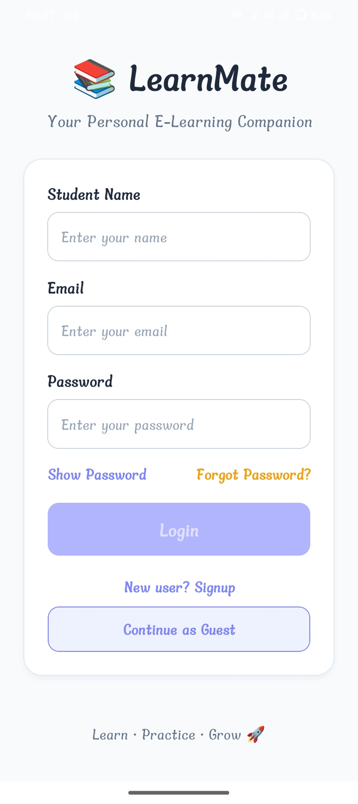
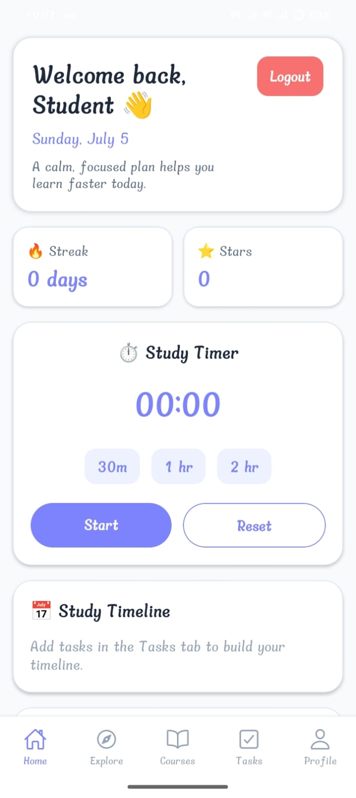
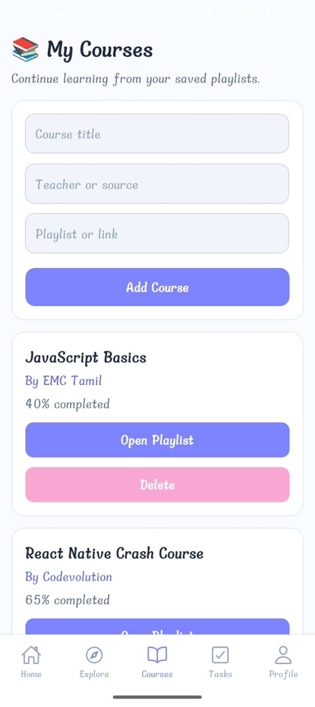
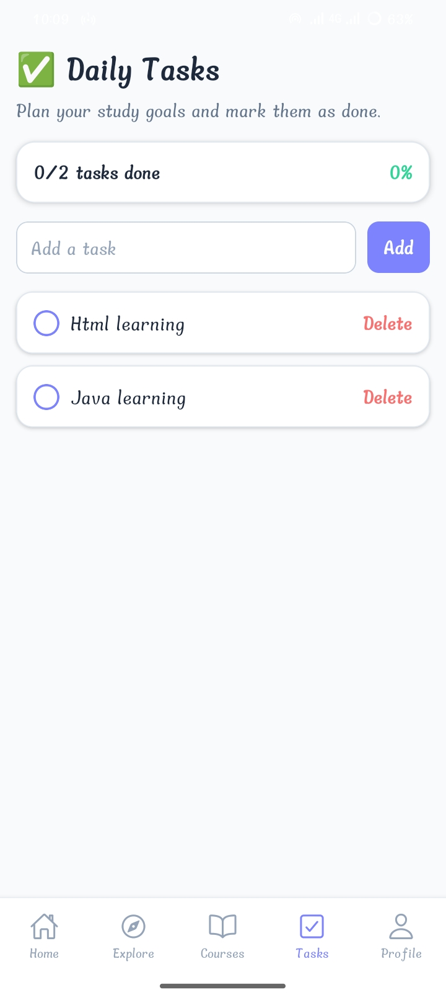
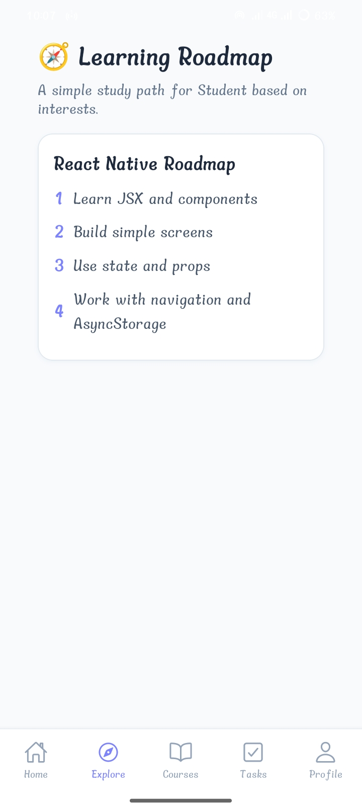
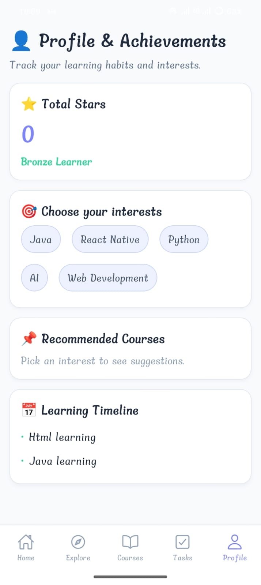

# 📱 Mission3App

A modern React Native mobile application built with clean UI, reusable components, and smooth navigation. This project demonstrates my React Native development skills, including responsive layouts, component-based architecture, and mobile app best practices.

---

## ✨ Features

- 🎨 Beautiful and responsive UI
- 📱 Cross-platform (Android & iOS)
- 🧭 React Navigation
- ⚡ Fast and optimized performance
- 🧩 Reusable components
- 📂 Clean folder structure
- 🌙 Modern mobile design

---

## 📸 Screenshots

> Add screenshots inside a `screenshots` folder.

| Home Screen | Details Screen |
|-------------|----------------|
|  |  |

---

## 🛠 Tech Stack

- React Native
- JavaScript
- React Navigation
- React Hooks
- StyleSheet API
- VS Code
- Git & GitHub

---

## 📁 Project Structure

```
Mission3App
│
├── assets/
├── components/
├── screens/
├── navigation/
├── constants/
├── App.js
├── package.json
└── README.md
```

---

## 🚀 Getting Started

### 1. Clone the repository

```bash
git clone https://github.com/yourusername/Mission3App.git
```

### 2. Navigate into the project

```bash
cd Mission3App
```

### 3. Install dependencies

```bash
npm install
```

### 4. Start Metro

```bash
npx react-native start
```

### 5. Run Android

```bash
npx react-native run-android
```

### 6. Run iOS (Mac only)

```bash
npx react-native run-ios
```

---

## 📦 Dependencies

- React Native
- React
- React Navigation
- React Native Screens
- React Native Safe Area Context

---

## 🎯 Learning Outcomes

Through this project, I learned:

- Building responsive mobile UIs
- Component-based architecture
- Navigation between screens
- State management using React Hooks
- Git & GitHub workflow
- Clean code organization

---

## 🔮 Future Improvements

- Authentication
- Dark Mode
- API Integration
- Firebase Backend
- Push Notifications
- Offline Storage
- Better Animations

---

## 👩‍💻 Developer

**Pavithra Rajaraman**

B.E. Electronics and Communication Engineering (ECE)

Passionate about Full Stack Development, React Native, and Mobile App Development.

GitHub:
https://github.com/pavithra192837-eng

---


## 📸 Screenshots

### 🚀 Splash Screen


### 🔐 Login Screen



### 🏠 Home Screen



### 📚 Courses Screen



### ✅ Tasks Screen



### 🔍 Explore Screen



### 👤 Profile Screen



## ⭐ Support

If you like this project, don't forget to ⭐ star the repository!

It motivates me to build more amazing projects.

---

## 📄 License

This project is created for learning and educational purposes.
